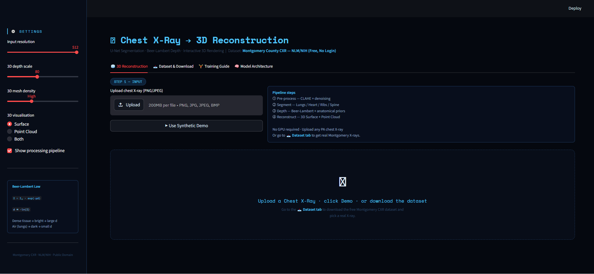
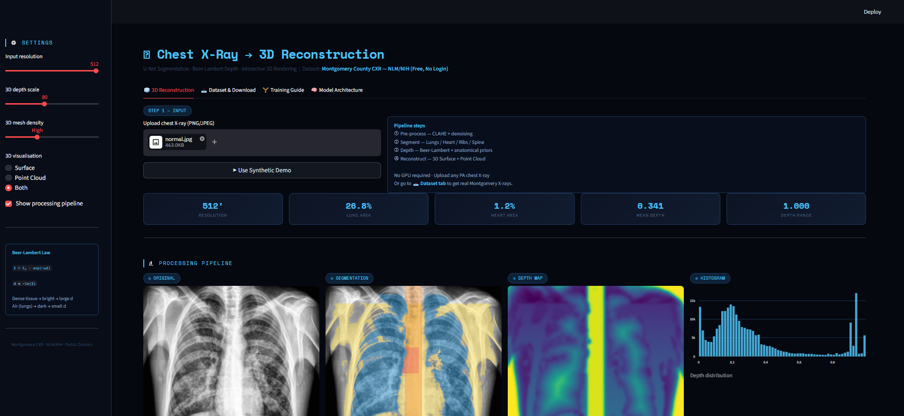
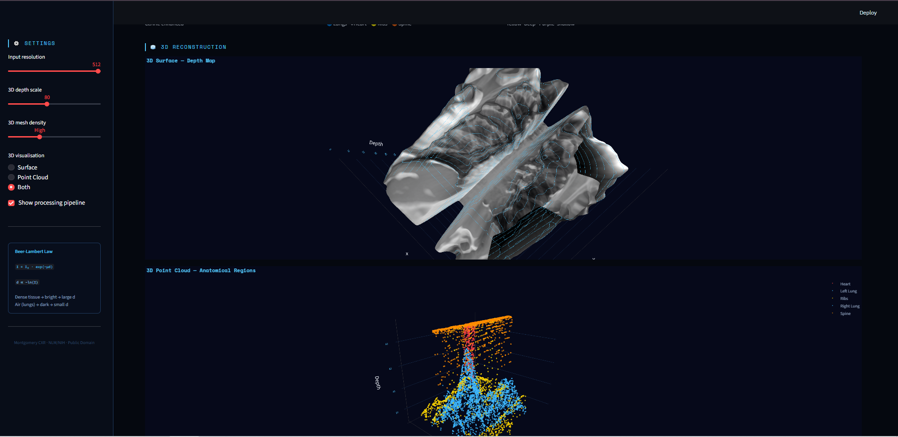

<div align="center">


<br/><br/>

# 🫁 Chest X-Ray → Pseudo-3D Reconstruction

### Advanced U-Net + Beer-Lambert Depth Estimation

*An end-to-end deep learning pipeline that transforms a 2D chest X-ray into an interactive 3D anatomical reconstruction — segmenting lungs, heart, ribs, and spine, then estimating pseudo-depth using physics-based Beer-Lambert modelling.*

<br/>

</div>

---

## 📸 Screenshots

<br/>

**① App Interface — Input & Pipeline Overview**



<br/>

**② Processing Pipeline — Segmentation & Depth Map on a Real X-Ray**



<br/>

**③ Interactive 3D Reconstruction — Surface + Point Cloud**



---

## 🎯 Project Overview

This project demonstrates how a single 2D chest X-ray can be transformed into a meaningful pseudo-3D anatomical model using classical computer vision, deep learning segmentation (U-Net), and physics-based depth estimation. The result is an interactive 3D visualisation rendered entirely in the browser — no GPU required for inference.

The system performs four sequential stages:

1. **Pre-processing** — CLAHE contrast enhancement + Gaussian denoising
2. **Segmentation** — Heuristic + U-Net multi-region segmentation (lungs, heart, ribs, spine)
3. **Depth Estimation** — Beer-Lambert law physics model refined with anatomical priors
4. **3D Reconstruction** — Interactive surface mesh and colour-coded point cloud via Plotly

---

## ✨ Features

- 🔬 **4-stage visual pipeline** — every intermediate result is shown side-by-side
- 🧠 **Advanced U-Net** with Attention Gates and dual output heads (segmentation + depth)
- 📐 **Beer-Lambert physics depth** — `d ∝ −ln(I)` — no CT ground truth required
- 🧊 **Interactive 3D Surface** — rotatable, zoomable depth mesh
- 🔵 **Colour-coded Point Cloud** — anatomical regions (lungs, heart, ribs, spine)
- 📥 **Built-in dataset downloader** — Montgomery CXR dataset (NLM/NIH, free, no login)
- 💾 **Export** — download depth map and segmentation mask as PNG
- 🖥️ **No GPU required** for demo — runs fully on CPU

---

## 🏗️ Project Structure

```
chest3d/
├── app.py              # Streamlit UI — 4 tabs (Reconstruction, Dataset, Training, Architecture)
├── processing.py       # Pre-processing, segmentation, depth estimation, 3D data builders
├── unet.py             # U-Net with Attention Gates (PyTorch) — segmentation + depth heads
├── dataset.py          # Dataset registry, download manager, ChestXRayDataset class
├── requirements.txt    # All Python dependencies
└── README.md
```

---

## 🧠 Model Architecture

The backbone is an **Advanced U-Net with Attention Gates**, featuring two output heads trained jointly.

```
Input  (1 × 512 × 512)
│
├─ DoubleConv(1 → 64)              ← Encoder input block
├─ Down(64 → 128)  + Dropout 15%  ← Encoder L1
├─ Down(128 → 256)                 ← Encoder L2
├─ Down(256 → 512)                 ← Encoder L3
│
├─ Bottleneck(512 → 1024)
│
├─ Up + AttentionGate(1024 → 512)  ← Decoder L3
├─ Up + AttentionGate(512  → 256)  ← Decoder L2
├─ Up + AttentionGate(256  → 128)  ← Decoder L1
├─ Up + AttentionGate(128  →  64)  ← Decoder L0
│
├─ SegHead:   Conv(64 → 4)  →  [Background | Left Lung | Right Lung | Heart]
└─ DepthHead: Conv(64 → 1)  →  Depth map ∈ [0, 1]
```

**Key design choices:**
| Component | Purpose |
|---|---|
| Attention Gates | Suppress irrelevant background before skip-connection merge |
| Bilinear Upsampling | Smoother depth maps, eliminates checkerboard artefacts |
| Dual Output Heads | Segmentation + depth share encoder weights, trained jointly |
| Dropout 15% | Prevents overfitting on small datasets (138 Montgomery images) |
| ~31M Parameters | Similar capacity to ResNet-encoder U-Net |

---

## 📐 Depth Estimation — Beer-Lambert Law

X-ray image formation follows the Beer-Lambert attenuation law:

```
I = I₀ · exp(−μd)
```

Rearranging for depth:

```
d  ∝  −ln(I / I₀)  ≈  −ln(I)     [after normalisation, I₀ = 1]
```

| Tissue | X-ray appearance | Attenuation μ | Estimated depth |
|---|---|---|---|
| Bone / Spine | Bright | High | Deep (0.80 – 0.90) |
| Heart muscle | Medium-bright | Medium-high | Mid (0.45 – 0.65) |
| Ribs | Bright curves | High | Anterior → posterior |
| Lungs (air) | Dark | Very low | Shallow (0.15 – 0.65) |

This raw depth is then refined with **anatomical priors** (EDT-based lung gradient, fixed spine depth, rib wrap model) and smoothed with a Gaussian filter (σ = 4).

---

## 📦 Datasets

All datasets are **free and require no login**.

| Dataset | Images | Size | Masks | Source |
|---|---|---|---|---|
| **Montgomery County CXR** ✅ | 138 | ~27 MB | ✅ Lung masks included | NLM / NIH |
| **Shenzhen Hospital CXR** | 662 | ~86 MB | ✗ | NLM / NIH |
| NIH ChestX-ray14 *(optional)* | 112,120 | ~45 GB | Bounding boxes | NIH |
| JSRT Database *(optional)* | 247 | ~300 MB | ✅ Nodule + lung masks | JSRT |

### Dataset URLs (hardcoded in `dataset.py`)

```python
# Montgomery County CXR
https://data.lhncbc.nlm.nih.gov/public/Tuberculosis-Chest-X-ray-Datasets/
Montgomery-County-CXR-Set/MontgomerySet.zip

# Shenzhen Hospital CXR
https://data.lhncbc.nlm.nih.gov/public/Tuberculosis-Chest-X-ray-Datasets/
Shenzhen-Hospital-CXR-Set/ShenzhenSet.zip
```

> **Citation:** Jaeger et al., "Two Public Chest X-Ray Datasets for Computer-Aided Screening of Pulmonary Diseases", *IEEE Transactions on Biomedical Engineering*, 2014.

---

## 🚀 Quick Start

### 1. Clone & Install

```bash
git clone https://github.com/tasneem123khliel/CXR-3D-Chest-X-Ray-2D-to-3D-Reconstruction .git
cd CXR-3D-Chest-X-Ray-2D-to-3D-Reconstruction 
pip install -r requirements.txt
```

### 2. Run the App

```bash
streamlit run app.py
```

Open [http://localhost:8501](http://localhost:8501) in your browser.

### 3. Download Dataset (inside the app)

Go to the **📥 Dataset & Download** tab → click **Download Montgomery CXR** — the app fetches and extracts the dataset automatically.

Or via command line:

```bash
wget "https://data.lhncbc.nlm.nih.gov/public/Tuberculosis-Chest-X-ray-Datasets/Montgomery-County-CXR-Set/MontgomerySet.zip" \
     -O data/MontgomerySet.zip
unzip data/MontgomerySet.zip -d data/montgomery/
```

### 4. Use the Python API

```python
from dataset import ChestXRayDataset

# Auto-downloads on first run
ds = ChestXRayDataset.from_download("montgomery", data_dir="./data")
print(f"Loaded {len(ds)} images")

img, mask = ds[0]   # numpy float32, normalised [0, 1]
print("Image:", img.shape, "| Mask:", mask.shape)
```

---

## 🏋️ Training

```python
# Full training script (see Training Guide tab in the app)
from dataset import ChestXRayDataset, make_torch_dataset
from unet import get_model
import torch
from torch import nn
from torch.utils.data import DataLoader, random_split
from torch.optim import AdamW

# 1. Load dataset — URL auto-downloaded
chest_ds = ChestXRayDataset.from_download("montgomery", data_dir="./data", image_size=512)

# 2. Split
n_val = int(len(chest_ds) * 0.15)
train_ds, val_ds = random_split(chest_ds, [len(chest_ds) - n_val, n_val])
train_loader = DataLoader(make_torch_dataset(train_ds), batch_size=4, shuffle=True)

# 3. Model
device = "cuda" if torch.cuda.is_available() else "cpu"
model  = get_model(device)

# 4. Train
optimizer = AdamW(model.parameters(), lr=1e-4, weight_decay=1e-4)
for epoch in range(100):
    for imgs, masks in train_loader:
        imgs, masks = imgs.to(device), masks.to(device)
        seg_pred, depth_pred = model(imgs)
        # ... compute loss, backward, step

torch.save(model.state_dict(), "unet_chest.pth")
```

**Recommended augmentations (albumentations):**
HorizontalFlip · RandomRotate90 · CLAHE · GaussNoise · ElasticTransform · RandomBrightnessContrast

**Expected results on Montgomery:**

| Metric | Value |
|---|---|
| Lung Dice | 0.94 – 0.97 |
| Heart Dice | 0.85 – 0.91 |
| Depth MAE | 0.08 – 0.12 |
| Inference (CPU) | ~0.3 s / image |

---

## 🛠️ Requirements

```
streamlit >= 1.32.0
numpy >= 1.24.0
opencv-python-headless >= 4.8.0
Pillow >= 10.0.0
scipy >= 1.11.0
scikit-image >= 0.22.0
plotly >= 5.18.0
torch >= 2.1.0
torchvision >= 0.16.0
```

Install all at once:

```bash
pip install -r requirements.txt
```

---

## 🗺️ Anatomical Colour Coding

| Structure | Colour | Depth Range | Notes |
|---|---|---|---|
| Left / Right Lung | 🔵 Blue `#3DB8FF` | 0.15 – 0.65 | Air-filled, large volume |
| Heart | ❤️ Red `#FF4444` | 0.45 – 0.65 | Dense muscle, mid-chest |
| Ribs | 🟡 Yellow `#FFD700` | 0.10 – 0.40 | Curved bone, anterior → posterior |
| Spine | 🟠 Orange `#FF8C00` | 0.80 – 0.90 | Deepest central structure |

---

## ⚠️ Limitations & Future Work

- **No CT ground truth** — depth is estimated/inferred, not measured from real 3D data
- **2D → 3D ambiguity** — X-ray integrates attenuation along the entire beam axis
- **Heart contour** — can be improved with a dedicated cardiac segmentation model
- **Future ideas:**
  - Pix2Pix / Conditional GAN to synthesise full CT slices from X-rays
  - Marching Cubes for true mesh extraction
  - DICOM input support for clinical use

---

## 📄 License

This project is released for educational and research purposes.  
Datasets are provided by the **U.S. National Library of Medicine (NLM)** under public domain.

---

## 👩‍💻 Author

<div align="center">

**Tasneem Yasser**

[](https://github.com/tasneem123khliel)
[](https://linkedin.com/in/tasneem-yasser-697284312)

*Built with ❤️ using PyTorch · Streamlit · Plotly · scikit-image*

</div>
